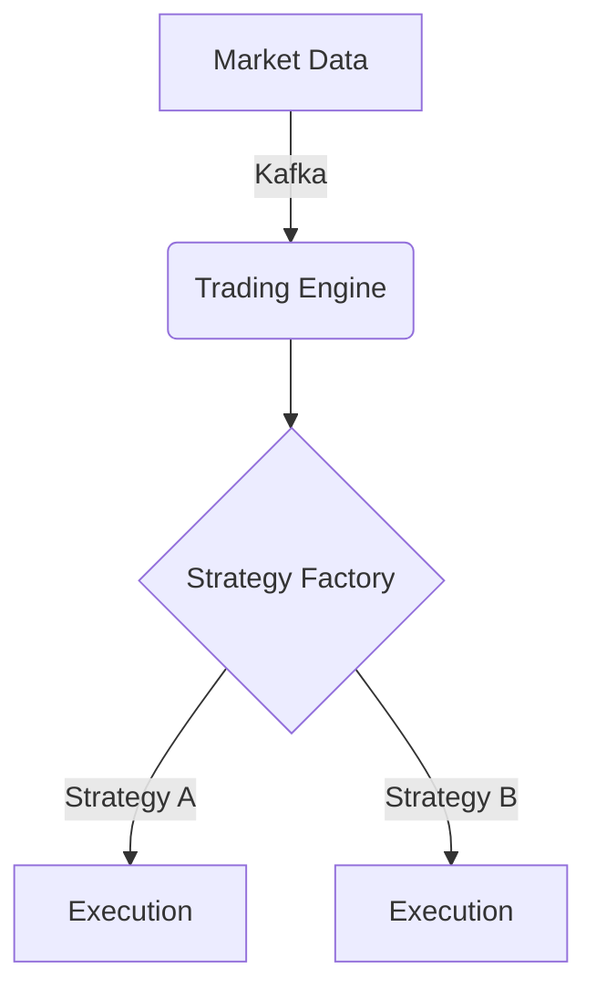
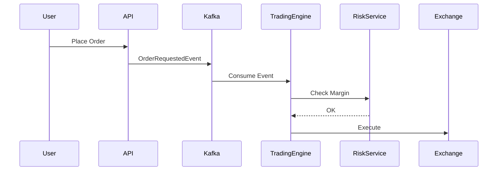

# Vibe Trading Coding Guidelines

This document is a consolidated view of all strict coding standards and software design principles for the Vibe Trading project.

---
---

# 1. Overview (README)

This directory contains the strict coding standards and software design principles for the Vibe Trading project. All contributors must adhere to these guidelines to ensure code quality, maintainability, and scalability.

## Core Pillars

1.  **[Design-First Workflow](#2-design-first-workflow)**: Diagrams and interfaces before implementation.
2.  **[Core Design Principles](#3-core-software-design-principles)**: SOLID, SRP, DRY, KISS, YAGNI.
3.  **Language Standards**:
    - [TypeScript & React](#4-typescript--react-coding-standards)
    - [Python & FastAPI](#5-python--fastapi-coding-standards)
4.  **Architectural Patterns**:
    - [Design Patterns](#6-architectural-design-patterns) (Strategy, Repository, Factory)
    - [Event-Driven Patterns](#7-event-driven-patterns-kafka) (Kafka, Idempotency)
5.  **[Operational Standards](#8-operational-standards)**: Testing (TDD), Logging, Error Handling.

---

*Refer to these guidelines during the "Analysis" phase of every track.*

---
---

# 2. Design-First Workflow

All development in Vibe Trading must follow a "Design-First" approach. This ensures architectural integrity and prevents "spaghetti" logic. Implementation code should be the *last* step, not the first.

## The Mandatory Lifecycle

### 1. Analysis & Pattern Identification
Before writing a single line of code, analyze the requirement to identify which Design Patterns are applicable.
- **Goal**: Avoid reinventing the wheel.
- **Action**: Research existing patterns (e.g., Strategy for multiple execution types, Factory for model selection).

### 2. Visual Design (Mermaid.js)
Visualize the solution. We use Mermaid.js for diagrams because they live in the documentation as code.

#### Architecture Diagrams
Show how modules interact.


#### Sequence Diagrams
Show the flow of data/events.


### 3. Contract Definition (Interface-First)
Define the "What" before the "How". Create Interfaces (TypeScript) or Abstract Base Classes (Python).

**Python Example:**
```python
from abc import ABC, abstractmethod

class OrderExecutor(ABC):
    @abstractmethod
    async def execute(self, order_data: dict) -> bool:
        pass
```

### 4. Implementation (TDD)
Only after the design is approved and interfaces are defined do you move to implementation. Follow the project's TDD workflow:
1. Write failing tests.
2. Implement minimum code to pass.
3. Refactor.

## Guidelines for Design
- **Single Responsibility**: Every diagram/interface should represent one clear responsibility.
- **Interface Segregation**: Don't force a module to implement methods it doesn't use.
- **Dependency Inversion**: High-level modules should not depend on low-level implementation; both should depend on abstractions (the Interfaces you defined in Step 3).

---
---

# 3. Core Software Design Principles

Adhering to these principles is mandatory for all modules in Vibe Trading.

## 1. SOLID Principles

### S: Single Responsibility Principle (SRP)
A class or function should have one, and only one, reason to change.

**Bad:**
```python
class TradingService:
    def execute_trade(self, order):
        # 1. Logic to validate order
        # 2. Logic to calculate risk
        # 3. Logic to call exchange API
        # 4. Logic to log to database
        pass
```

**Good:**
```python
class OrderValidator:
    def validate(self, order): ...

class RiskManager:
    def check_margin(self, order): ...

class ExchangeClient:
    async def place_order(self, order): ...

class TradingEngine:
    # Orchestrates the above specialized services
    pass
```

### O: Open/Closed Principle (OCP)
Software entities should be open for extension, but closed for modification. Use inheritance or composition to add new behavior.

### L: Liskov Substitution Principle (LSP)
Objects of a superclass should be replaceable with objects of its subclasses without breaking the application.

### I: Interface Segregation Principle (ISP)
Clients should not be forced to depend on methods they do not use. Prefer many small, specific interfaces over one large, general one.

### D: Dependency Inversion Principle (DIP)
Depend on abstractions, not concretions. High-level modules should not depend on low-level modules.

---

## 2. DRY (Don't Repeat Yourself)
Every piece of knowledge must have a single, unambiguous, authoritative representation within a system.
- Use shared libraries (`libs/`) for common logic.
- Use base classes or utility functions for repeated patterns.

## 3. KISS (Keep It Simple, Stupid)
Avoid unnecessary complexity. Simple code is easier to test, maintain, and debug.
- Prefer readable code over "clever" one-liners.
- If a function is hard to explain, it's likely too complex.

## 4. YAGNI (You Ain't Gonna Need It)
Don't implement functionality until it's actually needed.
- Avoid "future-proofing" that adds complexity today for a hypothetical requirement tomorrow.

## 5. Composition over Inheritance
Prefer building complex objects by combining simpler ones rather than creating deep inheritance hierarchies. This makes code more flexible and easier to test.

---
---

# 4. TypeScript & React Coding Standards

These standards apply to all TypeScript code in the `web` and `api` applications.

## 1. TypeScript Standards

### Strict Typing
- **No `any`**: The use of `any` is strictly prohibited. Use `unknown` if the type is truly unknown, and perform type narrowing.
- **Explicit Returns**: Always define the return type of exported functions.
- **Interfaces over Types**: Prefer `interface` for object definitions to allow for declaration merging, use `type` for unions or aliases.

### Naming Conventions
- **Classes/Interfaces/Types**: `PascalCase` (e.g., `UserService`).
- **Variables/Functions**: `camelCase` (e.g., `calculateTotal`).
- **Constants**: `UPPER_SNAKE_CASE` (e.g., `MAX_RETRY_ATTEMPTS`).
- **Files**: `kebab-case` (e.g., `auth-provider.tsx`).

### Functional Programming
- **Immutability**: Use `const` by default. Avoid mutating arrays; use `map`, `filter`, `reduce`.
- **Pure Functions**: Logic should be extracted into pure, testable functions whenever possible.

---

## 2. React Standards (React 19)

### Component Design
- **Functional Components**: Class components are prohibited.
- **Composition over Props Drilling**: Use Component Composition or Context/Zustand for state sharing.
- **Container/Presentational**: Separate logic (hooks) from UI (JSX).

### Hooks
- **Rules of Hooks**: Strictly follow the official Rules of Hooks.
- **Custom Hooks**: Extract complex logic into custom hooks (e.g., `useOrderBook`).
- **`use` Hook**: Leverage React 19's `use` for consuming promises and context where applicable.

### Styling (Tailwind CSS v4)
- **Utility-First**: Use Tailwind classes for styling.
- **Class Variance Authority (CVA)**: Use `cva` for components with multiple variants (e.g., buttons).

### Performance
- **Memoization**: Use `useMemo` and `useCallback` judiciously to prevent unnecessary re-renders in performance-critical areas (like market data grids).

## Example: Good Component
```tsx
interface PriceDisplayProps {
  price: number;
  currency: string;
}

/**
 * Pure presentational component for displaying prices.
 */
export const PriceDisplay = ({ price, currency }: PriceDisplayProps): JSX.Element => {
  const formattedPrice = useMemo(() => formatCurrency(price, currency), [price, currency]);

  return (
    <span className="font-mono text-lg font-bold text-green-500">
      {formattedPrice}
    </span>
  );
};
```

---
---

# 5. Python & FastAPI Coding Standards

These standards apply to all Python microservices in the `apps/` directory.

## 1. Python Standards

### Style & Linting
- **PEP 8**: Strictly adhere to PEP 8.
- **Ruff**: Use Ruff for linting and formatting. Configuration is defined in the root `pyproject.toml`.
- **Docstrings**: Use Google-style docstrings for all public modules, classes, and functions.

### Type Hinting
- **Mandatory Typing**: All function signatures must be fully type-hinted.
- **Pydantic**: Use Pydantic models for data validation and configuration.
- **Strict Mode**: MyPy/Ruff should be configured to fail on missing types in public APIs.

### Naming Conventions
- **Classes**: `PascalCase` (e.g., `MarketDataService`).
- **Variables/Functions/Methods**: `snake_case` (e.g., `get_market_tick`).
- **Constants**: `UPPER_SNAKE_CASE` (e.g., `KAFKA_BOOTSTRAP_SERVERS`).
- **Files/Modules**: `snake_case` (e.g., `data_processor.py`).

---

## 2. FastAPI Standards

### Endpoint Design
- **Async by Default**: Use `async def` for all path operation functions.
- **Dependency Injection**: Leverage FastAPI's `Depends` for shared logic, database sessions, and security checks.
- **Response Models**: Always define a `response_model` for every endpoint to ensure data validation and documentation accuracy.

### Exception Handling
- **Global Exception Handlers**: Use FastAPI exception handlers to catch and format errors into a standardized JSON response.
- **HTTPException**: Use `fastapi.HTTPException` for client-facing errors with clear status codes and messages.

### Project Structure (Microservice)
```text
src/
├── main.py          # Entry point, app initialization
├── config.py        # Settings via Pydantic BaseSettings
├── api/             # API routes/endpoints
├── services/        # Business logic
├── models/          # Pydantic schemas and database models
└── core/            # Shared utilities (logging, auth)
```

## Example: Good FastAPI Endpoint
```python
from fastapi import APIRouter, Depends, HTTPException
from pydantic import BaseModel

router = APIRouter()

class OrderResponse(BaseModel):
    order_id: str
    status: str

@router.post("/orders", response_model=OrderResponse)
async def create_order(
    order: OrderCreateSchema,
    service: TradingService = Depends(get_trading_service)
) -> OrderResponse:
    """
    Creates a new trading order.
    """
    try:
        return await service.process_order(order)
    except InsufficientFundsError as e:
        raise HTTPException(status_code=400, detail=str(e))
```

---
---

# 6. Architectural Design Patterns

This document details the common design patterns used across Vibe Trading to solve recurring architectural challenges.

## 1. Strategy Pattern
Use the Strategy Pattern to define a family of algorithms, encapsulate each one, and make them interchangeable.

**Use Case**: Implementing different trading strategies (e.g., Momentum, Mean Reversion, Arbitrage).

**Example (Python)**:
```python
from abc import ABC, abstractmethod

class TradingStrategy(ABC):
    @abstractmethod
    def decide(self, market_data): ...

class MomentumStrategy(TradingStrategy):
    def decide(self, market_data):
        # Implementation for momentum
        return "BUY"

class StrategyExecutor:
    def __init__(self, strategy: TradingStrategy):
        self._strategy = strategy

    def execute(self, data):
        return self._strategy.decide(data)
```

---

## 2. Repository Pattern
Use the Repository Pattern to mediate between the domain and data mapping layers. This decouples the business logic from data access details.

**Use Case**: Managing order persistence or market data snapshots.

**Example (Python)**:
```python
class OrderRepository(ABC):
    @abstractmethod
    def save(self, order): ...
    @abstractmethod
    def get_by_id(self, order_id): ...

class MongoOrderRepository(OrderRepository):
    # Implementation using MongoDB
    pass

class PostgresOrderRepository(OrderRepository):
    # Implementation using PostgreSQL
    pass
```

---

## 3. Factory Pattern
Use the Factory Pattern to create objects without specifying the exact class of object that will be created.

**Use Case**: Dynamically selecting an execution service or a machine learning model based on configuration.

**Example (TypeScript)**:
```typescript
interface ExchangeClient {
  placeOrder(order: Order): Promise<void>;
}

class BinanceClient implements ExchangeClient { ... }
class KrakenClient implements ExchangeClient { ... }

class ExchangeFactory {
  static getClient(exchangeName: string): ExchangeClient {
    if (exchangeName === 'binance') return new BinanceClient();
    if (exchangeName === 'kraken') return new KrakenClient();
    throw new Error('Unsupported exchange');
  }
}
```

---

## 4. Observer Pattern (Pub/Sub)
Used heavily via Kafka and WebSockets.
- **Microservices**: Services observe Kafka topics and react to events.
- **Frontend**: Components observe store changes (Zustand) or WebSocket streams.

## 5. Dependency Injection (DI)
Mandatory for decoupling.
- **FastAPI**: Use the `Depends()` system.
- **React**: Use Context API or specialized libraries if needed (though Props/Hooks often suffice).

---
---

# 7. Event-Driven Patterns (Kafka)

Kafka is the backbone of Vibe Trading. Adhering to these patterns ensures system reliability, data consistency, and scalability.

## 1. Producer Standards

### Idempotency
- **Enable Idempotence**: All producers must set `enable.idempotence=true` to prevent duplicate messages during retries.
- **Message Keys**: Always use a meaningful key (e.g., `order_id`, `symbol`) for messages to ensure that all events for a specific entity are processed in the same order by consumers.

### Schema Management
- **Schema Registry**: Use the Schema Registry to manage event schemas (Avro preferred, JSON Schema as alternative).
- **Backward Compatibility**: Never make breaking changes to schemas. Only add optional fields or remove optional fields.

---

## 2. Consumer Standards

### Idempotent Consumers
- **De-duplication**: Consumers must be able to handle the same message multiple times without unintended side effects. Use a database unique constraint or a "processed_events" table.
- **Atomic Commits**: Ensure that offset commits and database updates happen atomically where possible.

### Error Handling & DLQ
- **Retry Logic**: Implement exponential backoff for transient errors (e.g., network timeout).
- **Dead Letter Queue (DLQ)**: If a message fails after maximum retries or is malformed (poison pill), it must be sent to a DLQ topic (e.g., `orders.dlq`) for manual investigation. Never stop the consumer due to a single bad message.

---

## 3. Event Design

### Event vs. Command
- **Events**: Facts that have happened (Past tense: `OrderPlaced`, `TradeExecuted`). Use these for broadcasting state changes.
- **Commands**: Requests to perform an action (Imperative: `PlaceOrder`, `CancelTrade`). Use these for point-to-point communication via Kafka.

### Payload Structure
- **Metadata**: Every event must include a standard metadata header.
```json
{
  "header": {
    "event_id": "uuid-v4",
    "timestamp": "ISO-8601",
    "source": "trading-engine",
    "version": "1.0"
  },
  "payload": {
    "order_id": "123",
    "action": "BUY"
  }
}
```

## 4. Performance & Scaling
- **Consumer Groups**: Use consumer groups for horizontal scaling.
- **Partitioning**: Design partitioning keys to balance load while maintaining order for related entities.

---
---

# 8. Operational Standards

This document covers the "Day 2" concerns of software: Testing, Logging, and Error Handling.

## 1. Testing (TDD Mandate)

All code changes must follow the Test-Driven Development (TDD) cycle.

### Test Pyramid
- **Unit Tests (>80% coverage)**: Mandatory for all new business logic.
- **Integration Tests**: Required for Kafka producers/consumers and API endpoints.
- **E2E Tests**: Required for critical user flows (e.g., Auth, Placing an Order).

### Tooling
- **Frontend/API**: Jest
- **Python**: Pytest

---

## 2. Structured Logging

Logs are for machines to parse and humans to read.

### Guidelines
- **No `print()`**: Use the project's standard logger (`vibetrading.logger` in Python).
- **Log Levels**:
    - `DEBUG`: Verbose information for development.
    - `INFO`: Normal operational events (e.g., "Order processed").
    - `WARNING`: Unexpected events that don't stop the system (e.g., "Kafka retry").
    - `ERROR`: Events that require immediate attention (e.g., "Database connection failed").
- **Context**: Always include relevant IDs in log messages (e.g., `user_id`, `order_id`).

---

## 3. Error Handling

### Backend (Python/FastAPI)
- **Standardized Response**: All errors should return a consistent JSON structure.
```json
{
  "error": {
    "code": "INSUFFICIENT_FUNDS",
    "message": "User has insufficient balance for this trade.",
    "request_id": "uuid-v4"
  }
}
```
- **Fail Fast**: Validate inputs at the boundary (Pydantic/Zod) and fail immediately.

### Frontend (React)
- **Error Boundaries**: Use React Error Boundaries to prevent a single component crash from taking down the entire app.
- **Toast Notifications**: Use non-intrusive toast notifications for non-fatal errors.
- **Global Error State**: Use the `api-gateway` WebSocket connection to broadcast critical system errors to the UI.

## 4. Observability
- **Correlation IDs**: All requests should carry a correlation ID (Request ID) across microservices via Kafka headers and HTTP headers for distributed tracing.
