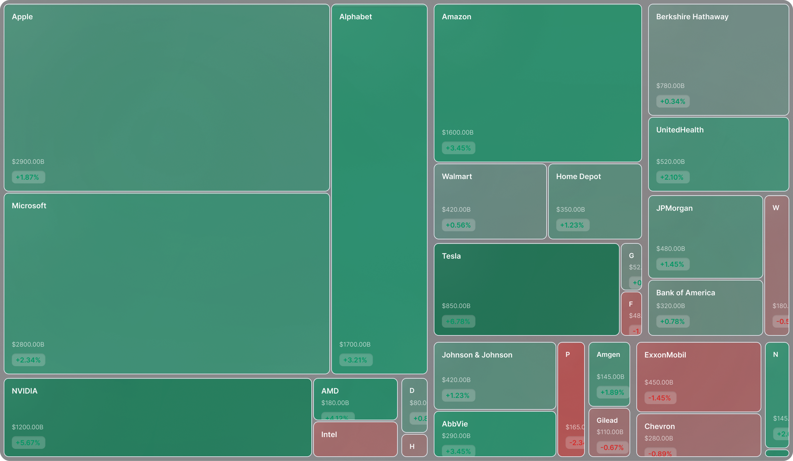

# Treemap Preview Application Design

**Date:** 2026-01-28
**Status:** Approved
**Type:** New Feature - Independent Preview Application

## Overview

Create an independent treemap visualization page for displaying 31 SW Level-1 sector indices. The application will be built as a standalone Next.js app (`apps/preview`) for rapid style iteration, then integrated into `apps/web` once finalized.

## Design Source

**Figma:** https://www.figma.com/design/O52eqHmOTyh0tzZwpC7sl9/landing-page?node-id=524-11


The design shows a heatmap visualization with:
- Sector tiles sized by market capitalization
- Color-coded by performance (Chinese market convention: **red=up, green=down**)
- Tile displays: sector name (top-left), breathing indicator (top-right), capital flow + change% (bottom-right)
- Supports light/dark theme with accessible border contrast (WCAG 2.0 AA: 3:1 minimum)

## Architecture

### System Flow

```
Browser (localhost:4300)
    ↓
apps/preview (Next.js + React)
    ↓
Mock Data (hardcoded in frontend)
    ↓
HeatMap Visualization (31 SW Level-1 Sectors)
```

### Data Flow

1. **Frontend mock data** hardcoded array of 31 SW Level-1 sectors
2. **Preview app** uses mock data directly for rendering
3. **No API calls** - pure frontend development for UI iteration
4. Pure display mode - no user interactions in initial version

**Note:** API integration will be added later. Focus is on UI design and styling first.

## Project Structure

```
apps/preview/
├── src/
│   └── app/
│       ├── layout.tsx           # Root layout with dark theme
│       ├── page.tsx             # Main treemap page
│       ├── components/
│       │   ├── HeatMap.tsx      # HeatMap container component
│       │   ├── Tile.tsx         # Individual sector tile
│       │   └── BreathingDot.tsx # Breathing indicator component
│       ├── types/
│       │   └── sector.ts        # Sector data TypeScript types
│       ├── data/
│       │   └── mockSectors.ts   # Mock data for 31 SW sectors
│       └── globals.css          # Tailwind CSS imports
├── tailwind.config.ts           # Independent Tailwind config
├── tsconfig.json                # TypeScript configuration
├── next.config.js               # Next.js config (static export)
└── project.json                 # Nx target configuration
```

## Data Model

### Sector Interface (TypeScript)

```typescript
interface Sector {
  code: string;           // Sector code, e.g., "801010"
  name: string;           // Sector name, e.g., "农林牧渔"
  marketCap: number;      // Market cap in 亿元 (determines tile size)
  changePercent: number;  // Change percentage (determines color)
  capitalFlow: number;    // Capital flow in 亿元 (positive=inflow, negative=outflow)
  attentionLevel: number; // Attention level 0-100 (determines breathing indicator frequency)
}
```

### Mock Data (Frontend)

**File:** `apps/preview/src/data/mockSectors.ts`

```typescript
export const mockSectors: Sector[] = [
  {
    code: "801010",
    name: "农林牧渔",
    marketCap: 12500.0,
    changePercent: 1.85,
    capitalFlow: 320.5,
    attentionLevel: 45
  },
  {
    code: "801020",
    name: "煤炭",
    marketCap: 18200.0,
    changePercent: -2.15,
    capitalFlow: -580.2,
    attentionLevel: 88
  },
  {
    code: "801030",
    name: "有色金属",
    marketCap: 22100.0,
    changePercent: 0.95,
    capitalFlow: 450.8,
    attentionLevel: 62
  },
  {
    code: "801040",
    name: "钢铁",
    marketCap: 14300.0,
    changePercent: -1.45,
    capitalFlow: -320.0,
    attentionLevel: 55
  },
  {
    code: "801050",
    name: "基础化工",
    marketCap: 25800.0,
    changePercent: 2.35,
    capitalFlow: 680.5,
    attentionLevel: 72
  },
  {
    code: "801080",
    name: "建筑",
    marketCap: 16500.0,
    changePercent: 0.65,
    capitalFlow: 210.3,
    attentionLevel: 38
  },
  {
    code: "801110",
    name: "建材",
    marketCap: 13200.0,
    changePercent: -0.85,
    capitalFlow: -180.5,
    attentionLevel: 42
  },
  {
    code: "801120",
    name: "轻工制造",
    marketCap: 11800.0,
    changePercent: 1.25,
    capitalFlow: 155.0,
    attentionLevel: 35
  },
  {
    code: "801140",
    name: "机械",
    marketCap: 19500.0,
    changePercent: 1.75,
    capitalFlow: 425.8,
    attentionLevel: 58
  },
  {
    code: "801150",
    name: "电力设备",
    marketCap: 28900.0,
    changePercent: 3.25,
    capitalFlow: 920.5,
    attentionLevel: 91
  },
  {
    code: "801160",
    name: "国防军工",
    marketCap: 15600.0,
    changePercent: -1.95,
    capitalFlow: -410.2,
    attentionLevel: 76
  },
  {
    code: "801170",
    name: "汽车",
    marketCap: 21500.0,
    changePercent: 2.85,
    capitalFlow: 650.0,
    attentionLevel: 82
  },
  {
    code: "801180",
    name: "商贸零售",
    marketCap: 12900.0,
    changePercent: 0.45,
    capitalFlow: 95.5,
    attentionLevel: 28
  },
  {
    code: "801200",
    name: "消费者服务",
    marketCap: 14800.0,
    changePercent: 1.55,
    capitalFlow: 280.0,
    attentionLevel: 48
  },
  {
    code: "801210",
    name: "家电",
    marketCap: 16200.0,
    changePercent: -0.95,
    capitalFlow: -220.5,
    attentionLevel: 52
  },
  {
    code: "801230",
    name: "纺织服装",
    marketCap: 9800.0,
    changePercent: 0.35,
    capitalFlow: 65.0,
    attentionLevel: 22
  },
  {
    code: "801710",
    name: "医药",
    marketCap: 32500.0,
    changePercent: 1.95,
    capitalFlow: 780.5,
    attentionLevel: 68
  },
  {
    code: "801720",
    name: "食品饮料",
    marketCap: 35800.0,
    changePercent: 2.15,
    capitalFlow: 850.0,
    attentionLevel: 74
  },
  {
    code: "801730",
    name: "农业",
    marketCap: 11200.0,
    changePercent: -1.25,
    capitalFlow: -195.0,
    attentionLevel: 44
  },
  {
    code: "801780",
    name: "银行",
    marketCap: 45200.0,
    changePercent: 0.85,
    capitalFlow: 520.0,
    attentionLevel: 56
  },
  {
    code: "801790",
    name: "非银行金融",
    marketCap: 28500.0,
    changePercent: 1.45,
    capitalFlow: 480.5,
    attentionLevel: 64
  },
  {
    code: "801880",
    name: "房地产",
    marketCap: 18900.0,
    changePercent: -2.85,
    capitalFlow: -720.0,
    attentionLevel: 92
  },
  {
    code: "801890",
    name: "交通运输",
    marketCap: 17200.0,
    changePercent: 0.55,
    capitalFlow: 135.5,
    attentionLevel: 40
  },
  {
    code: "801980",
    name: "电子",
    marketCap: 38500.0,
    changePercent: 3.15,
    capitalFlow: 1050.0,
    attentionLevel: 95
  },
  {
    code: "801990",
    name: "通信",
    marketCap: 14500.0,
    changePercent: 1.05,
    capitalFlow: 210.0,
    attentionLevel: 50
  },
  {
    code: "802010",
    name: "计算机",
    marketCap: 26800.0,
    changePercent: 2.65,
    capitalFlow: 720.5,
    attentionLevel: 78
  },
  {
    code: "802020",
    name: "传媒",
    marketCap: 12300.0,
    changePercent: -0.65,
    capitalFlow: -125.0,
    attentionLevel: 36
  },
  {
    code: "802030",
    name: "电力及公用事业",
    marketCap: 15800.0,
    changePercent: 0.25,
    capitalFlow: 58.0,
    attentionLevel: 25
  },
  {
    code: "802040",
    name: "石油石化",
    marketCap: 24500.0,
    changePercent: -1.75,
    capitalFlow: -520.5,
    attentionLevel: 70
  },
  {
    code: "802050",
    name: "环保",
    marketCap: 10500.0,
    changePercent: 1.35,
    capitalFlow: 165.0,
    attentionLevel: 46
  },
  {
    code: "802060",
    name: "美容护理",
    marketCap: 13800.0,
    changePercent: 0.75,
    capitalFlow: 125.5,
    attentionLevel: 32
  }
];
```

**Data Characteristics:**
- Total sectors: 31 (complete SW Level-1 classification)
- Market cap range: ¥9,800亿 to ¥45,200亿
- Change range: -2.85% to +3.25%
- Capital flow range: -¥720亿 to +¥1,050亿
- Attention level range: 22 to 95 (varied breathing frequencies)

## Component Design

### Component Hierarchy

```
App (layout.tsx + page.tsx)
  └── HeatMap.tsx (data fetching & layout calculation)
        └── Tile.tsx × 31 (individual sector tiles)
              ├── Sector name (top-left)
              ├── BreathingDot.tsx (top-right, frequency based on attentionLevel)
              ├── Capital flow + Change % (bottom-right)
              └── Background color (gradient based on change%)
```

### HeatMap Implementation

**Library:** Recharts `<Treemap>` component (used for treemap-style layout)

**Configuration:**
- `data`: Array of 31 sectors
- `dataKey="marketCap"`: Determines tile size
- Custom `content`: Renders `Tile` component
- Responsive container with full viewport dimensions

### Visual Design (from Figma)

**Color Scheme (Chinese Market Convention):**

**⚠️ Important: Chinese market uses RED for UP, GREEN for DOWN (opposite of Western markets)**

- **Positive/Up (Red)**: `#7d1f2e` (deep) to `#a52a3a` (medium)
  - OKLCH: `oklch(0.35-0.45 0.18 15)` with intensity based on change%
  - Used when `changePercent > 0`
- **Negative/Down (Green)**: `#0d7d5e` (deep) to `#1aa179` (medium)
  - OKLCH: `oklch(0.45-0.55 0.15 150)` with intensity based on change%
  - Used when `changePercent < 0`

**Theme Support:**

**Dark Mode (Default):**
- Background: `#0a0f0d` (dark charcoal)
- Borders: `#374151` (gray-700, provides 4.5:1 contrast with background)
- Text: `#ffffff` (white)
- Border width: 2px
- Border radius: 4px (small rounded corners)

**Light Mode:**
- Background: `#f9fafb` (gray-50)
- Borders: `#d1d5db` (gray-300, provides 3.5:1 contrast with background)
- Text: `#111827` (gray-900)
- Border width: 2px
- Border radius: 4px (small rounded corners)

**Accessibility Requirements:**
- Border-to-background contrast ratio: **≥ 3:1** (WCAG 2.0 AA)
- Text-to-background contrast ratio: **≥ 4.5:1** (WCAG 2.0 AA for normal text)
- Tile color gradients maintain sufficient contrast in both themes

**Tile Layout:**
- **Top-left**: Sector name
  - Dark mode: `#ffffff` (white, 14-16px, font-weight: 600)
  - Light mode: `#111827` (gray-900, 14-16px, font-weight: 600)
- **Top-right**: Breathing indicator dot (animated, frequency based on attentionLevel)
  - High attention (80-100): Fast pulse (0.8s cycle)
  - Medium attention (40-79): Medium pulse (1.5s cycle)
  - Low attention (0-39): Slow pulse (3s cycle)
- **Bottom-right**:
  - Capital flow (12px, format: "±¥XXX亿" with arrow icon)
    - Positive flow: Red color (matching market convention)
    - Negative flow: Green color (matching market convention)
  - Change percentage (10px, format: "+2.5%")
    - Color matches tile background gradient
- **Padding**: 8-12px
- **Border**: Theme-aware with accessible contrast (≥3:1)

**Color Intensity Calculation:**
```typescript
// Map change% to color intensity (0-5% range)
const intensity = Math.min(Math.abs(changePercent) / 5, 1);
```

## Technical Stack

### Framework & Libraries

- **Framework**: Next.js 15 (static export mode)
- **UI Library**: React 19
- **Language**: TypeScript
- **Styling**: Tailwind CSS v4 (OKLCH color space)
- **Charts**: Recharts v3 (Treemap component)
- **Monorepo**: Nx 22.3.3

### Configuration Files

**next.config.js:**
```javascript
module.exports = {
  output: 'export',
  images: { unoptimized: true },
  async rewrites() {
    return [{
      source: '/api/:path*',
      destination: 'http://localhost:8201/api/:path*'
    }]
  }
}
```

**Theme Management:**
- Use `next-themes` for light/dark mode toggle
- Default theme: `dark`
- Theme persistence: localStorage
- Apply theme class to root `<html>` element
- Use Tailwind `dark:` prefix for dark mode styles

**project.json:**
```json
{
  "name": "preview",
  "targets": {
    "serve": {
      "executor": "@nx/next:server",
      "options": {
        "buildTarget": "preview:build",
        "dev": true,
        "port": 4300
      }
    },
    "build": {
      "executor": "@nx/next:build",
      "options": {
        "outputPath": "dist/apps/preview"
      }
    }
  }
}
```

## Implementation Details

### Data Usage

```typescript
// apps/preview/src/app/page.tsx
import { mockSectors } from '@/data/mockSectors';

export default function PreviewPage() {
  // Use mock data directly - no API calls needed
  const sectors = mockSectors;

  return (
    <main className="min-h-screen bg-gray-50 dark:bg-[#0a0f0d]">
      <HeatMap data={sectors} />
    </main>
  );
}
```

### Color Calculation

**Chinese Market Convention: Red = UP, Green = DOWN**

```typescript
function getSectorColor(changePercent: number, theme: 'light' | 'dark' = 'dark'): string {
  // Chinese market: positive change = RED, negative change = GREEN
  if (changePercent > 0) {
    // UP = RED
    const intensity = Math.min(changePercent / 5, 1);
    const lightness = theme === 'light' ? 0.40 : 0.35;
    return `oklch(${lightness + intensity * 0.1} 0.18 15)`;
  } else if (changePercent < 0) {
    // DOWN = GREEN
    const intensity = Math.min(Math.abs(changePercent) / 5, 1);
    const lightness = theme === 'light' ? 0.50 : 0.45;
    return `oklch(${lightness + intensity * 0.1} 0.15 150)`;
  } else {
    // No change = neutral gray
    return theme === 'light' ? '#9ca3af' : '#6b7280';
  }
}
```

### Data Formatting

```typescript
// Format capital flow: 450.0 → "+¥450亿" or -300.0 → "-¥300亿"
function formatCapitalFlow(value: number): string {
  const sign = value >= 0 ? '+' : '';
  return `${sign}¥${Math.abs(value).toFixed(0)}亿`;
}

// Format change: 2.5 → "+2.5%"
function formatChangePercent(value: number): string {
  const sign = value >= 0 ? '+' : '';
  return `${sign}${value.toFixed(2)}%`;
}

// Calculate breathing animation duration based on attention level
function getBreathingDuration(attentionLevel: number): number {
  if (attentionLevel >= 80) return 0.8; // Fast
  if (attentionLevel >= 40) return 1.5; // Medium
  return 3.0; // Slow
}
```

### Breathing Indicator Animation

**Component:** `BreathingDot.tsx`

```typescript
interface BreathingDotProps {
  attentionLevel: number; // 0-100
}

// CSS animation with Tailwind
<div
  className="w-2 h-2 rounded-full bg-white/90"
  style={{
    animation: `breathing ${getBreathingDuration(attentionLevel)}s ease-in-out infinite`
  }}
/>

// Tailwind animation keyframe (in globals.css)
@keyframes breathing {
  0%, 100% { opacity: 1; transform: scale(1); }
  50% { opacity: 0.3; transform: scale(0.8); }
}
```

**Visual Design:**
- Dot size: 8px × 8px
- Color (dark mode): `#ffffff` with 90% opacity
- Color (light mode): `#111827` with 80% opacity
- Position: Absolute top-right corner (8-12px from edges)
- Animation: Fade + scale pulse effect
- No glow/shadow (clean minimal design)

## Development Workflow

### Development Commands

```bash
# Start preview app (independent development)
npx nx run preview:serve
# → Access at http://localhost:4300

# Build preview app
npx nx run preview:build

# Lint code
npx nx run preview:lint

# Type check
npx nx run preview:type-check
```

### Development Ports

| Service | Port | Purpose |
|---------|------|---------|
| preview (dev) | 4300 | Preview app development server |

**Note:** No backend services required - pure frontend development with mock data.

## Future Integration into apps/web

Once styling is finalized, integrate into main web app:

### Step 1: Copy Code

```bash
mkdir -p apps/web/src/app/preview
cp -r apps/preview/src/app/* apps/web/src/app/preview/
```

### Step 2: Adjust Imports

- Merge Tailwind configurations
- Replace duplicate components with shared ones (if any)
- Update API paths if needed

### Step 3: Test Integration

- Access `http://localhost:4200/preview`
- Verify API routing works
- Test data fetching

### Step 4: Cleanup

- Remove `apps/preview` directory
- Keep this design doc for reference

## Future: API Integration (Not in Phase 1)

**Phase 1 (Current):** Use frontend mock data only
**Phase 2 (Future):** Add real-time data integration

### Future API Architecture

When ready to integrate real data:

1. **market-data service** provides `/sectors` endpoint
2. **Express API** proxies to market-data
3. **Preview app** fetches from `/api/preview/sectors`
4. **Mock data** replaced with live updates

This design document focuses on **Phase 1 UI development** with hardcoded mock data.

## Interaction Design

### Phase 1: Pure Display (Current)

- Static treemap visualization
- No hover effects
- No click interactions
- No filters or controls
- Focus: Style refinement and visual accuracy

### Phase 2: Future Enhancements (Post-Integration)

- Hover tooltips with detailed sector info
- Click to drill down into sector constituents
- Time range selector (1D, 1W, 1M, etc.)
- Real-time updates via WebSocket
- Export/share functionality

## Chinese Market Conventions

**⚠️ Critical: This application follows Chinese stock market color conventions**

### Color Semantics (Opposite of Western Markets)

| Direction | China | West |
|-----------|-------|------|
| **Price Up** | 🔴 **RED** | 🟢 Green |
| **Price Down** | 🟢 **GREEN** | 🔴 Red |
| **No Change** | ⚪ Gray | ⚪ Gray |

### Implementation Guidelines

1. **Never** assume red = bad, green = good
2. **Always** check `changePercent` sign, not color semantics
3. **Capital flow colors** also follow this convention:
   - Positive flow (inflow): Red
   - Negative flow (outflow): Green
4. **User education**: Consider adding a legend/tooltip explaining colors for international users

### Cultural Context

- Red is an auspicious color in Chinese culture → used for gains
- Green has neutral/cooling connotation → used for losses
- This convention is standardized across all Chinese stock exchanges (SSE, SZSE, HKEX)

## Responsive Design

- **Desktop (1920px+)**: Full treemap layout
- **Tablet (768-1920px)**: Adaptive scaling
- **Mobile (<768px)**: Not prioritized (desktop-first visualization)

## Success Criteria

### Functionality
1. ✅ Independent app runs on port 4300
2. ✅ Displays 31 SW Level-1 sectors correctly
3. ✅ Tile sizes proportional to market cap
4. ✅ Data fetches correctly from market-data service via API

### Visual Design
5. ✅ Matches Figma visual design (layout, typography, spacing)
6. ✅ **Chinese market colors**: RED for up, GREEN for down (verified)
7. ✅ Light/dark theme toggle works correctly
8. ✅ Breathing indicator animates at correct frequency

### Accessibility (WCAG 2.0 AA)
9. ✅ Border-to-background contrast ≥ 3:1 in both themes
10. ✅ Text-to-background contrast ≥ 4.5:1 in both themes
11. ✅ Color is not the only means of conveying information (use text labels)
12. ✅ Tile gradients maintain sufficient contrast

### Code Quality
13. ✅ Clean, maintainable code structure
14. ✅ TypeScript types are explicit and correct
15. ✅ Components follow single responsibility principle
16. ✅ Easy integration path into apps/web

### Performance
17. ✅ Fast iteration for style adjustments
18. ✅ Smooth breathing animations (no jank)
19. ✅ Responsive to theme changes

## Non-Goals

- ❌ Docker deployment (development only, no production docker needed)
- ❌ User authentication
- ❌ Data persistence
- ❌ Real market data integration (mock only)
- ❌ Mobile responsiveness (desktop-first)
- ❌ Complex interactions (Phase 1)

## Technical Decisions

### Why Next.js instead of Vite?

- **Consistency**: apps/web uses Next.js, same tech stack
- **Easy integration**: Can directly copy code to apps/web later
- **No rewrite needed**: Same framework = smooth migration

### Why independent app instead of /preview page in apps/web?

- **Isolation**: No risk of breaking existing web app
- **Fast iteration**: Independent build/serve cycles
- **Clean separation**: Clear boundary during development
- **Easy cleanup**: Remove when integrated

### Why Recharts for treemap?

- **Already in stack**: No new dependencies
- **React-first**: Native React component
- **Flexible**: Custom rendering with SectorCard
- **Proven**: Used in existing dashboards

## Timeline Estimate

Not provided - focus on implementation tasks, not time predictions.

## Related Documentation

- Figma Design: https://www.figma.com/design/O52eqHmOTyh0tzZwpC7sl9/landing-page?node-id=524-11
- CLAUDE.md: Project guidelines and conventions
- SW Industry Classification: 申万一级行业分类标准

---

**Next Steps:**
1. Set up git worktree for isolated development
2. Create implementation plan with detailed tasks
3. Set up preview Next.js application structure
4. Implement mock data (31 SW sectors)
5. Build HeatMap and Tile components
6. Implement breathing indicator animation
7. Add light/dark theme support
8. Style refinement iterations
9. Integration into apps/web
