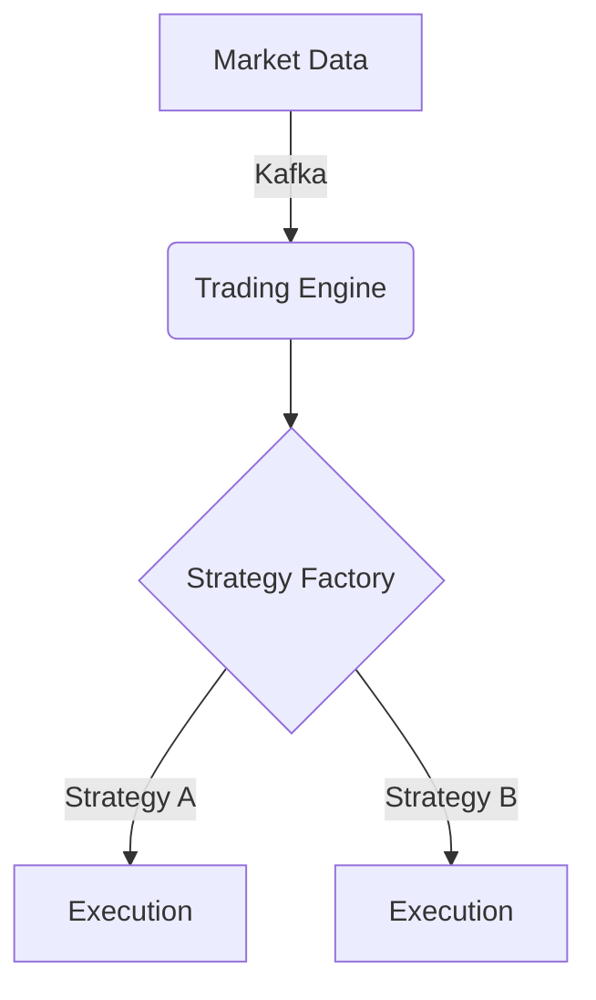
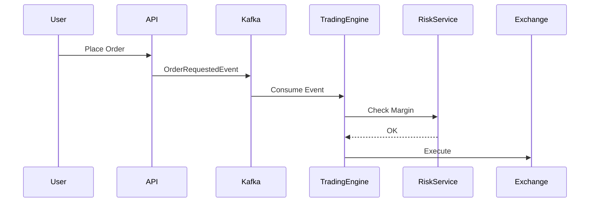

# Design-First Workflow

All development in Vibe Trading must follow a "Design-First" approach. This ensures architectural integrity and prevents "spaghetti" logic. Implementation code should be the *last* step, not the first.

## The Mandatory Lifecycle

### 1. Analysis & Pattern Identification
Before writing a single line of code, analyze the requirement to identify which Design Patterns are applicable.
- **Goal**: Avoid reinventing the wheel.
- **Action**: Research existing patterns (e.g., Strategy for multiple execution types, Factory for model selection).

### 2. Visual Design (Mermaid.js)
Visualize the solution. We use Mermaid.js for diagrams because they live in the documentation as code.

#### Architecture Diagrams
Show how modules interact.


#### Sequence Diagrams
Show the flow of data/events.


### 3. Contract Definition (Interface-First)
Define the "What" before the "How". Create Interfaces (TypeScript) or Abstract Base Classes (Python).

**Python Example:**
```python
from abc import ABC, abstractmethod

class OrderExecutor(ABC):
    @abstractmethod
    async def execute(self, order_data: dict) -> bool:
        pass
```

### 4. Implementation (TDD)
Only after the design is approved and interfaces are defined do you move to implementation. Follow the project's TDD workflow:
1. Write failing tests.
2. Implement minimum code to pass.
3. Refactor.

## Guidelines for Design
- **Single Responsibility**: Every diagram/interface should represent one clear responsibility.
- **Interface Segregation**: Don't force a module to implement methods it doesn't use.
- **Dependency Inversion**: High-level modules should not depend on low-level implementation; both should depend on abstractions (the Interfaces you defined in Step 3).