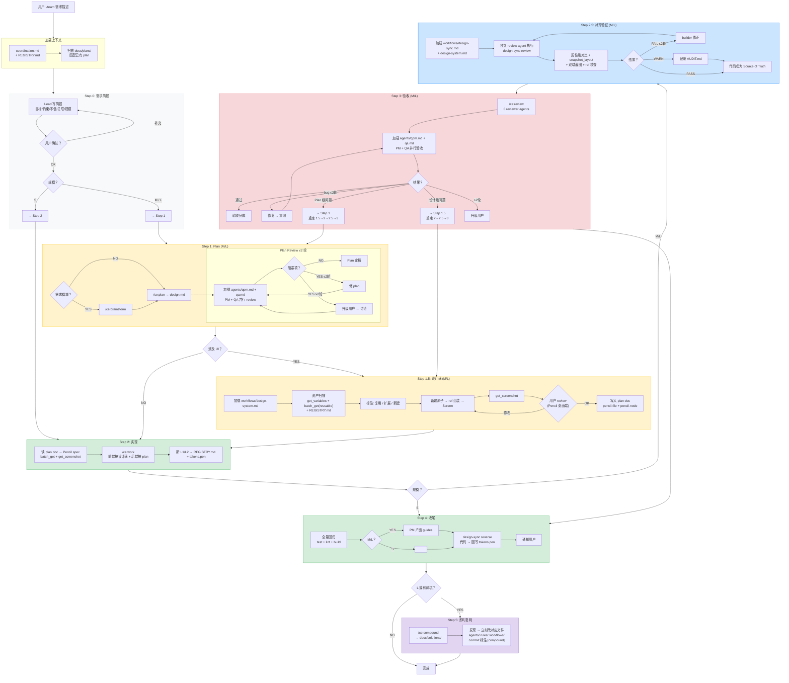

# /team 工作流全图

> 你了解 /team 工作流的入口。所有细节见 `.claude/` 目录下的对应文件。



## 文件结构速查

```
.claude/
├── commands/team.md         ← 唯一用户命令（/team）
├── rules/                   ← 始终加载
│   ├── product-vision.md
│   └── component-design-system.md
├── agents/                  ← 按需注入 subagent
│   ├── qpm.md
│   ├── qa.md
│   └── quant-domain-reviewer.md
└── workflows/               ← 按需加载
    ├── coordination.md      ← 协调规则
    ├── design-system.md     ← 换算表 + 组件规范
    └── design-sync.md       ← 像素级对齐

docs/team/workflow-diagram.md ← 本文件（你在这里）
```

## 规模分级速查

| 规模 | Step 0 | Step 1      | Step 1.5 | Step 2              | Step 2.5           | Step 3      | Step 4              | Step 5       |
| ---- | ------ | ----------- | -------- | ------------------- | ------------------ | ----------- | ------------------- | ------------ |
| S    | 简报   | -           | -        | 实现                | -                  | -           | 回归 + reverse sync | 如有发现     |
| M    | 简报   | Plan+Review | 设计稿   | 实现+注册           | design-sync review | Review+验收 | 回归+guides+reverse | 即时复利     |
| L    | 简报   | Plan+Review | 设计稿   | 实现+注册(worktree) | design-sync review | Review+验收 | 回归+guides+reverse | /ce:compound |

## 退出条件

| 循环          | 位置     | 参与者         | 退出条件           | 硬上限              |
| ------------- | -------- | -------------- | ------------------ | ------------------- |
| Plan review   | Step 1c  | PM + QA + 用户 | 三方共识, 无阻塞项 | 2 轮/批, 升级后重置 |
| 设计稿 review | Step 1.5 | 用户 + Lead    | 用户确认 OK        | 无 (用户主导)       |
| 对齐验证      | Step 2.5 | Review agent   | 无 FAIL            | 2 轮修正            |
| 验收          | Step 3b  | PM + QA        | 全部通过           | 2 轮, 超过升级用户  |
