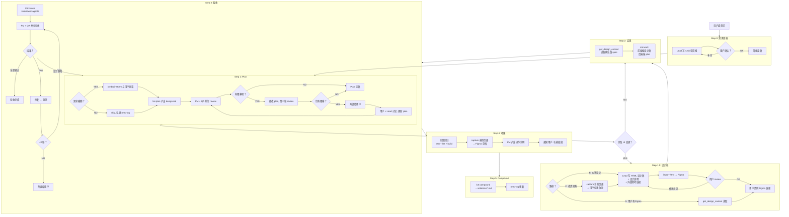
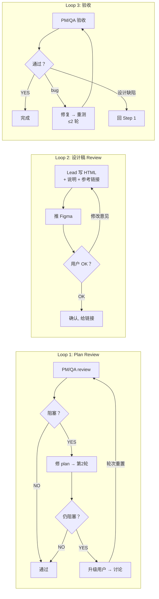
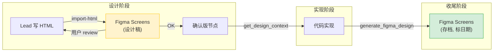

# /team 工作流全图

## 主流程

## 三个循环

## Figma 数据流

## 退出条件总结

| 循环 | 位置 | 参与者 | 退出条件 | 硬上限 |
|------|------|--------|----------|--------|
| Plan review | Step 1c | PM + QA + 用户 | 三方共识, 无阻塞项 | 2 轮/批, 升级后重置 |
| 设计稿 review | Step 1.5 | 用户 + Lead | 用户确认 OK + 提供 Figma 链接 | 无 (用户主导) |
| 验收 | Step 3b | PM + QA | 全部通过 | 2 轮, 超过升级用户 |
